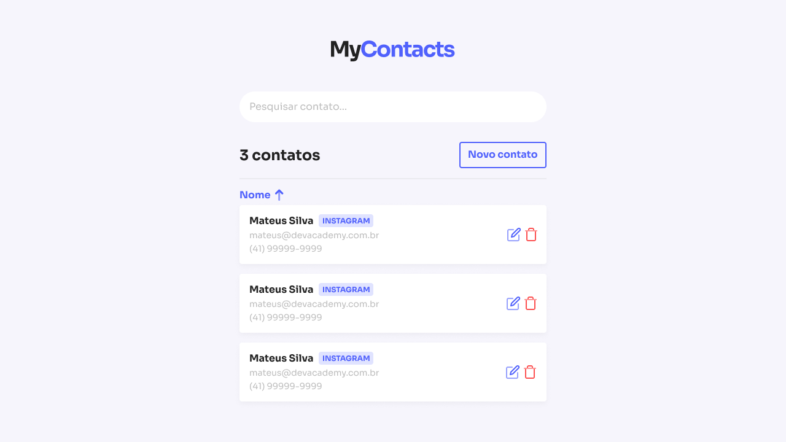

<h3 align="center">
  My-Contacts
</h3>

<p align="center">
   
 </p>

O projeto simula uma lista de contatos e armazena os dados no banco de dados de acordo com as ações definidas pelo o usuário. Construímos 3 rotas na aplicação, uma rota Home que vai ser responsável por carregar os dados desse banco de dados e apresentar todos os contatos que o usuário já possui cadastrado, tal como realizar modifições ou excluir um determinado contato.

A rota para adicionar um novo contato vai fazer a conexão entre a nossa aplicação e o banco de dados onde esta armazenado as informações do contato, e adicionar um novo contato através de um formulário preenchido pelo usuário.

E a última rota é para realizar modificões em um contato já existe, através de um formulário parecido com o formulário que visualizamos na roda para adicionar um novo contato.

## Tecnologias Utilizadas

**Client:** React, Vite, Styled-Components.

**Server:** Node, Express.

**Database:** PostgreSQL.

## Funcionalidades

- CRUD de Contatos
- CRUD de Categorias
- Responsivo

## API Reference

### Categorias

#### Listar categorias

```bash
  GET /categories
```

#### Criar categoria

```bash
  POST /categories
```

| Parameter | Type     | Description                       |
| :-------- | :------- | :-------------------------------- |
| `name`      | `string` | **Obrigatório**. Nome para a categoria |

#### Editar categoria

```bash
  PATCH /categories
```

| Parameter | Type     | Description                       |
| :-------- | :------- | :-------------------------------- |
| `id`      | `string` | **Obrigatório**. Id para encontrar o item |
| `name`      | `string` | **Obrigatório**. Nome para a categoria |

#### Excluir categoria

```bash
  DELETE /categories/:categoryId
```

| Parameter | Type     | Description                       |
| :-------- | :------- | :-------------------------------- |
| `id`      | `string` | **Obrigatório**. Id para encontrar o item |

### Contatos

#### Listar contatos

```bash
  GET /contacts
```

#### Criar contato

```bash
  POST /contacts
```

| Parameter | Type     | Description                       |
| :-------- | :------- | :-------------------------------- |
| `name`         | `string` | **Obrigatório**. Nome do contato |
| `email`        | `string` | **Obrigatório**. email do contato |
| `phone`        | `string` | **Obrigatório**. telefone do contato |
| `category`     | `string` | **Obrigatório**. Id da Categoria para o contato |

#### Editar contato

```bash
  PATCH /contacts
```

| Parameter | Type     | Description                       |
| :-------- | :------- | :-------------------------------- |
| `id`         | `string` | **Obrigatório**. ID do contato |
| `name`         | `string` | **Obrigatório**. Nome do contato |
| `email`        | `string` | **Obrigatório**. email do contato |
| `phone`        | `string` | **Obrigatório**. telefone do contato |
| `category`     | `string` | **Obrigatório**. Id da Categoria para o contato |

#### Deletar contato

```bash
  DELETE /contacts/:productId
```

| Parameter | Type     | Description                       |
| :-------- | :------- | :-------------------------------- |
| `id`      | `string` | **Obrigatório**. Id do item |

Clone o projeto

```bash
  git clone https://github.com/jp-prud/my-contacts
```

Entre no diretório do projeto

```bash
  cd my-contacts
```

Acesse o diretório do back-end do projeto

```bash
 cd back-end
```

Baixe o Docker e instale através deste link

```bash
https://docs.docker.com/desktop/install/windows-install/
```

Instale e Rode os schemas do BD - Schema dentro do repositório
```bash
docker run --name pg -e POSTGRES_USER=root -e POSTGRES_PASSWORD=root -p 5432:5432 -d postgres
```

Após estes comandos, siga o processo abaixo para criar o Banco de Dados
```
docker exec -it pg bash

psql -U root root

CREATE DATABASE mycontacts;
```

Rode as criações de tabela presente dentro do arquivo de `Schema.sql` prasente dentro da pasta chamada `database`.

Instale as dependências e inicie o projeto.

```bash
  yarn start
```

Para rodar o Desktop, acesse a pasta "front-end" a partir do diretório raiz do projeto
```bash
 cd front-end
```

Após isto, rode o comando:

```bash
 yarn dev
```

## Autores

- [@jpprud_](https://github.com/jp-prud)
